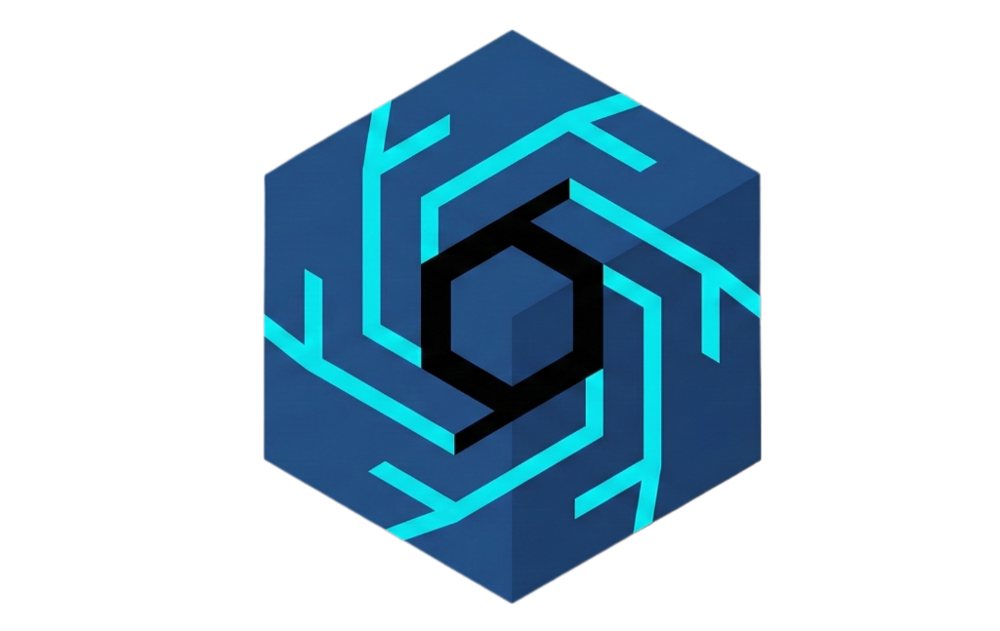

# Cottus Runtime v0.1

<p align="center">
  
</p>

<h3 align="center">
High-performance C++/CUDA LLM inference engine with Python bindings.
</h3>

<div align="center">

[](https://pypi.org/project/cottus-runtime/)
[](https://www.python.org/)
[](https://en.cppreference.com/w/cpp/17)
[](https://developer.nvidia.com/cuda-toolkit)
[](https://opensource.org/licenses/Apache-2.0)

</div>

Cottus Runtime is a custom inference engine built from scratch for Llama architectures, prioritizing low-latency and strict memory management.

## Features
- **Core:** Custom C++20 Transformer implementation.
- **Memory:** PagedAttention with BlockAllocator for efficient KV cache management.
- **Compute:** CUDA-accelerated kernels for Attention, RoPE, and GEMM (cuBLAS).
- **Parity:** Exact token matching with HuggingFace Transformers (verified).
- **Interface:** Clean Python API via PyBind11.

## Installation

### Prerequisites
- NVIDIA GPU with CUDA 11/12 (Recommended)
- C++ Compiler (GCC 10+ or Clang 12+)
- CMake 3.18+
- Python 3.8+

### Install from Source
```bash
# Clone repository
git clone https://github.com/cottus-ai/cottus-runtime.git
cd cottus-runtime

# Create virtual environment (Recommended)
python3 -m venv .venv
source .venv/bin/activate

# Install in editable mode
pip install -e .
```

## Quick Start

### 1. Basic Inference (Tiny Random Model)
```bash
python examples/1_basic_inference.py --device cuda
```

### 2. CPU Fallback
No GPU? No problem.
```bash
python examples/2_cpu_inference.py
```

### 3. Real Chat (TinyLlama-1.1B)
Requires ~2.2GB download.
```bash
python examples/3_tinyllama_real.py
```

## Usage

The best way to get started is to look at the **[examples/](examples/)** directory, which contains complete scripts for various use cases:

*   **[1_basic_inference.py](examples/1_basic_inference.py)**: Minimal example running on CUDA.
*   **[2_cpu_inference.py](examples/2_cpu_inference.py)**: Running on CPU (no GPU required).
*   **[3_tinyllama_real.py](examples/3_tinyllama_real.py)**: Loading and running the real TinyLlama-1.1B model.
*   **[4_long_context.py](examples/4_long_context.py)**: Stress testing with long context windows.

### Basic Example
```python
from cottus import Engine, EngineConfig
from cottus.model import load_hf_model

# 1. Load Model Weights
weights, _, _, tokenizer, _ = load_hf_model("TinyLlama/TinyLlama-1.1B-Chat-v1.0", device="cuda")

# 2. Config
config = EngineConfig()
config.model_type = "llama"
config.hidden_dim = 2048
config.num_layers = 22
config.num_heads = 32
config.num_kv_heads = 4
config.head_dim = 64
config.intermediate_dim = 5632
config.device = "cuda"

# 3. Helpers
engine = Engine(config, weights)
input_ids = tokenizer.encode("Hello!")

# 4. Generate
output_ids = engine.generate(input_ids, max_new_tokens=20)
print(tokenizer.decode(output_ids))
```

## License

Cottus Runtime is licensed under the Apache License Version 2.0. By contributing to the project, you agree to the license and copyright terms therein and release your contribution under these terms.
