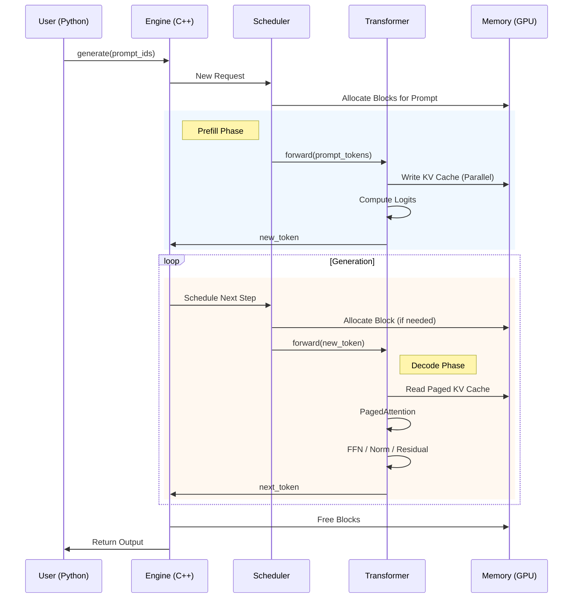

# Execution Pipeline

The inference loop is the heart of the engine. It processes input tokens and generates new ones in an autoregressive manner.

## Step-by-Step Flow

1.  **Prefill**: The prompt is processed in parallel (all tokens at once).
2.  **Decode**: New tokens are generated one by one.

