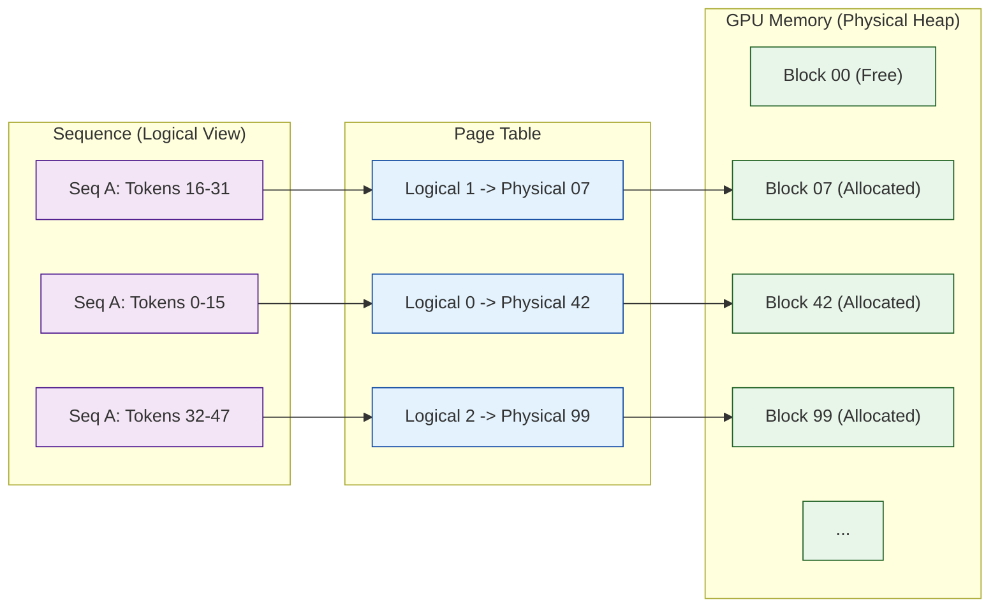

# Memory Hierarchy & PagedAttention

Cottus uses a **Paged Memory Management** system inspired by OS virtual memory to eliminate fragmentation and handle dynamic sequence lengths efficiently.

## Block-Based Allocation

Instead of allocating contiguous memory for each request (which causes fragmentation), we break the Key-Value (KV) Cache into fixed-size **Blocks**.

- **Block Size**: Configurable (default 16 tokens).
- **Physical Block**: A contiguous slice of GPU memory holding KV data for `blockSize` tokens.
- **Logical Block**: A virtual view of a block seen by the sequence.

## Address Translation

The `PageTable` maps Logical Block IDs to Physical Block IDs.



This allows non-contiguous physical memory to appear contiguous to the attention mechanism via the `PagedAttention` kernel.

## GPU-Resident KV Cache (v0.2+)

The KV cache is **persistent on GPU** to eliminate PCIe bottlenecks:

- **`d_kvCache_`**: Pre-allocated at `Engine` construction, freed at destruction
- **Quantization on GPU**: FP32→FP16 via `quantizeAndCacheCUDA()` kernel
- **Zero CPU Round-Trips**: K/V computed on GPU → quantized on GPU → stored in GPU cache

```
Old Flow (per token):
  GPU: Compute K,V → cudaMemcpy D2H → CPU: Quantize → cudaMemcpy H2D → GPU Cache

New Flow (per token):
  GPU: Compute K,V → quantizeAndCacheKernel → GPU Cache (no memcpy!)
```

See `notes/architecture_sync/20260112_gpu_memory_subsystem.md` for details.
