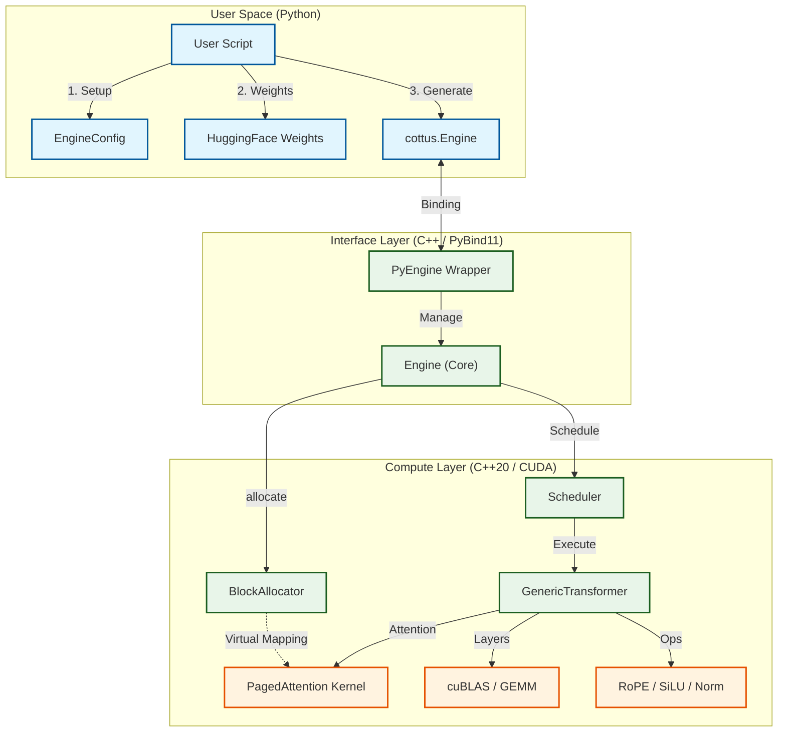

# System Overview

This document outlines the high-level architecture of the Cottus Runtime.

## Component Interaction

The system is divided into three main layers:
1.  **User Space (Python)**: Handles configuration, weight loading, and tokenizer interaction.
2.  **Interface Layer (C++/PyBind11)**: Manages state, memory, and orchestrates the pipeline.
3.  **Compute Layer (C++/CUDA)**: Executes the actual math operations on the hardware.

